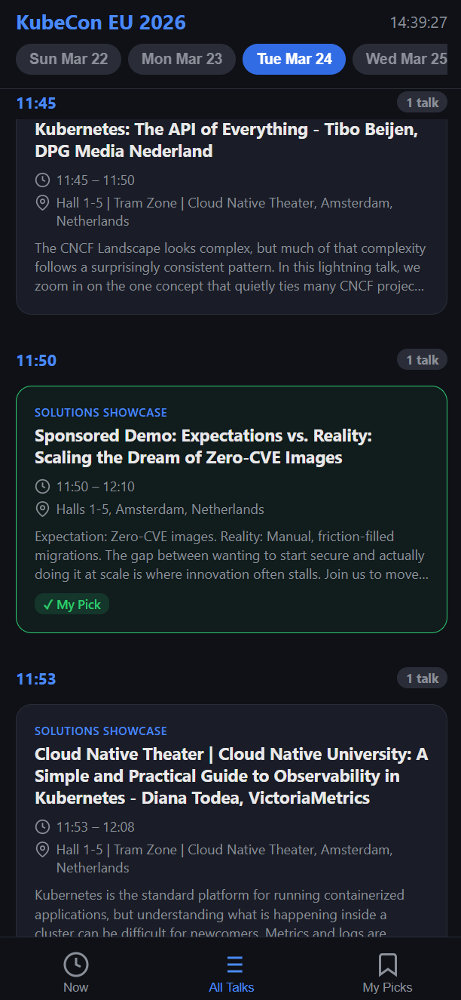

# KubeCon 2026 Schedule Viewer

This is a mobile-friendly web app for browsing the KubeCon EU 2026 schedule. It loads daily event data from ICS files, lets you swipe through upcoming talks, pick favorites, and view all talks grouped by time.

## Features
- Fast loading: ICS files are split by day for quick access
- Mobile-first UI: Swipeable cards, timeline, and carousel views
- Local picks: Select your favorite talks and see them in "My Picks"

## Screenshot

